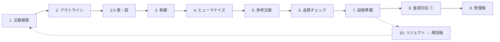
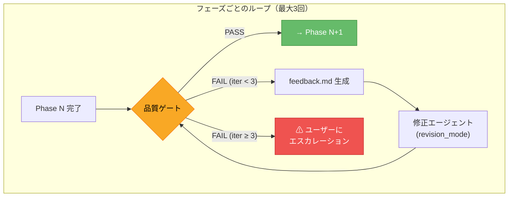
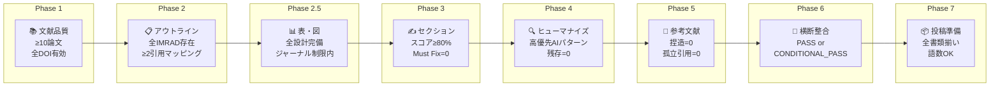
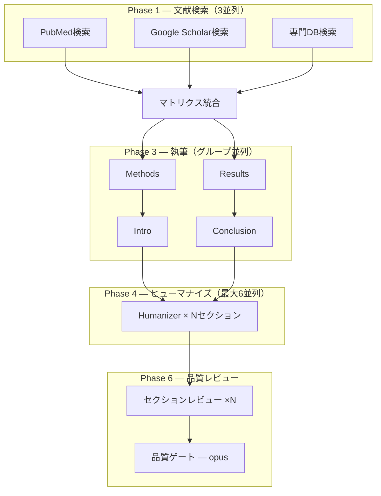

# Paper Writer Skill（日本語ドキュメント）

Claude Code用の医学論文執筆スキル。文献検索から投稿・リジェクト対応まで、論文執筆の全工程をカバーする。

> **English version → [README.md](README.md)**

## 概要

**10フェーズ**の完全なパイプラインで、IMRAD形式の論文プロジェクトディレクトリを自動生成・管理する。



## アーキテクチャ: 自律ステージゲートシステム (v3.1)

全フェーズに品質ゲートを配置。ゲートが**FAIL**を返すと、構造化フィードバックを自動生成し、修正エージェントを`revision_mode`で起動、再チェック。最大3イテレーションでユーザーにエスカレーション。**PASSするまで次のフェーズに進めない**。



### 8つの品質ゲート



### チームモード: 7並列エージェント (v3.0)

各フェーズで専門エージェントが並列実行：



| エージェント | 役割 | モデル |
|-------------|------|--------|
| `paper-lit-searcher` | DB別文献検索 | sonnet |
| `paper-table-figure-planner` | 表・図設計 | sonnet |
| `paper-section-drafter` | セクション執筆（パラメータ化） | sonnet |
| `paper-humanizer` | AI文体パターン除去 | haiku |
| `paper-ref-builder` | 引用収集・検証 | sonnet |
| `paper-section-reviewer` | セクション品質チェック | sonnet |
| `paper-quality-gate` | 横断整合検証・最終判定 | opus |

## 対応論文タイプ（6種）

| タイプ | 構成 | 報告ガイドライン |
|--------|------|------------------|
| **Original Article** | Full IMRAD | STROBE / CONSORT |
| **Case Report** | Intro / Case / Discussion | CARE |
| **Review Article** | テーマ別セクション | — |
| **Systematic Review** | PRISMA準拠 | PRISMA 2020 |
| **Letter / Short Communication** | 短縮IMRAD | 同上 |
| **Study Protocol** | SPIRIT準拠 | SPIRIT 2025 |

## 使い方

### Claude Codeから呼び出す

```
/paper-writer
```

または自然言語で：
- `論文を書く` / `論文執筆` / `原稿作成`
- `write paper` / `start manuscript`

### 初回セットアップ

呼び出すと以下を聞かれる：

1. **仮タイトル**
2. **論文タイプ**（上記6種から選択）
3. **対象ジャーナル**（任意、推奨）
4. **言語**（English / Japanese / Both）
5. **リサーチクエスチョン**（1文）
6. **利用可能なデータ**（表・図の有無）

ジャーナルを指定すると、word limit・citation style・abstract形式などを自動調査してREADME.mdに記録する。

## 生成されるプロジェクト構造 (v3.2)

各論文プロジェクトは、研究の立ち上げから完成までを包括的に管理するディレクトリを生成します：

```
{project-dir}/
├── README.md                        # プロジェクトダッシュボード（状態・タイムライン・リンク）
├── 00_literature/                   # 文献検索・マトリクス
├── 01_outline.md                    # 論文骨格
├── sections/                        # 原稿セクション（執筆順）
│   ├── 02_methods.md ... 08_title.md
├── tables/                          # 表（番号付き）
├── figures/                         # 図・キャプション
├── supplements/                     # 補足資料
│   ├── supplementary-tables/
│   ├── supplementary-figures/
│   └── appendices/
├── data/                            # 研究データ（raw → processed → analysis）
│   ├── raw/                         # 元データ（読み取り専用、gitignore）
│   ├── processed/                   # クリーニング・匿名化済み
│   ├── analysis/                    # 統計出力
│   └── data-dictionary.md
├── ethics/                          # 倫理審査・同意書・プロトコル・登録
├── submissions/                     # 投稿履歴（v1_bmj/, v2_lancet/, ...）
│   └── v1_{journal}/               # コンパイル原稿・カバーレター・宣言書
├── revisions/                       # 修正ラウンド（r1/, r2/, ...）
│   └── r1/                          # 査読コメント・回答書・差分
├── coauthor-review/                 # 共著者フィードバック管理
├── correspondence/                  # 編集者・査読者との通信記録
├── references/                      # フォーマット済み参考文献リスト
├── checklists/                      # 品質ゲート・報告ガイドライン追跡
└── log/                             # 意思決定・会議メモ・タイムライン
```

## ファイル構成

```
paper-writer/
├── SKILL.md                           # メインワークフロー定義
├── CHANGELOG.md                       # 変更履歴
├── README.md                          # 英語ドキュメント
├── README.ja.md                       # このファイル（日本語）
│
├── templates/                         # 31ファイル — セクション別テンプレート
│   ├── project-init.md                # プロジェクト初期化（Original Article）
│   ├── project-init-case.md           # プロジェクト初期化（Case Report）
│   ├── literature-matrix.md           # 文献比較マトリクス
│   ├── methods.md                     # Methods執筆ガイド
│   ├── results.md                     # Results執筆ガイド
│   ├── introduction.md                # Introduction執筆ガイド
│   ├── discussion.md                  # Discussion執筆ガイド
│   ├── conclusion.md                  # Conclusion執筆ガイド
│   ├── abstract.md                    # Abstract執筆ガイド（Original Article）
│   ├── cover-letter.md                # カバーレターテンプレート
│   ├── submission-ready.md            # 投稿前チェックリスト
│   ├── case-report.md                 # Case Presentation（CARE準拠）
│   ├── case-introduction.md           # Case Report Introduction
│   ├── case-abstract.md               # Case Report Abstract（CARE形式）
│   ├── review-article.md              # Review Article構成ガイド
│   ├── sr-outline.md                  # Systematic Reviewアウトライン
│   ├── sr-data-extraction.md          # SRデータ抽出テンプレート
│   ├── sr-prisma-flow.md              # PRISMAフローダイアグラム
│   ├── sr-grade.md                    # GRADEエビデンス評価
│   ├── sr-rob.md                      # Risk of Bias評価
│   ├── sr-prospero.md                 # PROSPERO登録テンプレート
│   ├── response-to-reviewers.md       # 査読者への回答テンプレート
│   ├── revision-cover-letter.md       # 改訂時カバーレター
│   ├── declarations.md                # 宣言テンプレート（倫理・COI・資金・AI開示）
│   ├── graphical-abstract.md          # グラフィカルアブストラクトガイド
│   ├── title-page.md                  # タイトルページテンプレート
│   ├── highlights.md                  # Key Points / Highlights（JAMA, BMJ等）
│   ├── limitations-guide.md           # Limitations記載ガイド
│   ├── acknowledgments.md             # 謝辞テンプレート
│   ├── proof-correction.md            # 受理後の校正ガイド
│   ├── data-management.md             # データ管理（raw/processed/analysis）
│   └── analysis-workflow.md           # データ解析ワークフローガイド
│
├── references/                        # 27ファイル — リファレンス資料
│   ├── imrad-guide.md                 # IMRAD構造と執筆原則
│   ├── section-checklist.md           # セクション別品質チェックリスト
│   ├── citation-guide.md              # 引用形式と管理
│   ├── citation-verification.md       # 引用検証ガイド
│   ├── reporting-guidelines.md        # 報告ガイドラインサマリー
│   ├── reporting-guidelines-full.md   # 20+報告ガイドライン詳細
│   ├── humanizer-academic.md          # AI文体検出（EN 18 + JP 13パターン）
│   ├── statistical-reporting.md       # 統計報告ガイド
│   ├── statistical-reporting-full.md  # 拡張SAMPLガイド
│   ├── journal-selection.md           # ジャーナル選択戦略
│   ├── pubmed-query-builder.md        # PubMed検索クエリ構築
│   ├── multilingual-guide.md          # 多言語対応ガイド
│   ├── coauthor-review.md             # 共著者レビュープロセス
│   ├── ai-disclosure.md               # ICMJE 2023 AI開示ガイド
│   ├── tables-figures-guide.md        # 表・図作成ガイド
│   ├── keywords-guide.md              # キーワード・MeSH選択戦略
│   ├── supplementary-materials.md     # 補足資料戦略
│   ├── hook-compatibility.md          # Claude Codeフック互換性
│   ├── submission-portals.md          # 投稿ポータルガイド
│   ├── open-access-guide.md           # OAモデル・APC・ライセンス
│   ├── clinical-trial-registration.md # 臨床試験登録ガイド
│   ├── abstract-formats.md            # ジャーナル別抄録形式
│   ├── word-count-limits.md           # ジャーナル別語数制限
│   ├── coi-detailed.md               # COI詳細・CRediT・ORCID
│   ├── desk-rejection-prevention.md   # デスクリジェクト防止
│   ├── journal-reformatting.md        # ジャーナル再フォーマット
│   └── master-reference-list.md       # マスターURL一覧（100+リンク）
│
└── scripts/                           # 5ファイル — ユーティリティ・解析
    ├── compile-manuscript.sh           # セクション統合スクリプト
    ├── word-count.sh                  # 語数カウント
    ├── forest-plot.py                 # フォレストプロット生成
    ├── table1.py                      # Table 1生成（ベースライン特性）
    └── analysis-template.py           # 統計解析テンプレート（t検定、ロジスティック、生存分析）
```

**合計: 66ファイル**（テンプレート31 + リファレンス27 + スクリプト5 + SKILL.md + CHANGELOG.md + README.md）

## ワークフロー（10フェーズ）

| Phase | 内容 | 主な操作 |
|-------|------|----------|
| **0** | プロジェクト初期化 | ジャーナル要件調査、報告ガイドライン選択、ディレクトリ生成、データ管理・解析 |
| **1** | 文献検索・整理 | PubMed/Google Scholar検索、文献マトリクス作成 |
| **2** | アウトライン | 論文骨格の設計（ユーザー承認必須） |
| **2.5** | 表・図 | 執筆前に表・図を設計 |
| **3** | 執筆 | Methods→Results→Intro P3+Conclusion→Discussion→Intro P1-2→Abstract→Title |
| **4** | ヒューマナイズ | AI文体パターン除去（EN 18 + JP 13パターン） |
| **5** | 参考文献 | 引用整理、形式統一、存在確認 |
| **6** | 品質チェック | セクション横断検証、報告ガイドラインチェック |
| **7** | 投稿準備 | カバーレター、タイトルページ、宣言、最終チェック |
| **8** | 査読対応 | コメント整理、回答レター、改訂実施 |
| **9** | 受理後 | 校正（24-72時間）、校正提出、出版後タスク |
| **10** | リジェクト対応 | 評価、再フォーマット、カスケード投稿戦略 |

## 報告ガイドライン（20+）

CONSORT 2025, STROBE, PRISMA 2020, CARE, STARD 2015, SQUIRE 2.0, SPIRIT 2025, TRIPOD+AI 2024, ARRIVE 2.0, CHEERS 2022, MOOSE, TREND, SRQR, COREQ, AGREE II, RECORD, STREGA, ENTREQ, PRISMA-ScR, GRADE

## 言語対応

| 言語 | 対応内容 |
|------|----------|
| **English** | 全テンプレート・ガイド対応、AI文体検出18パターン |
| **日本語** | 全テンプレートEN/JP併記、AI文体検出13パターン、「である」調 |

## AI文体除去（Humanizer）

学術論文からAI生成っぽさを除去する専用フェーズ（Phase 4）。

- **英語**: 18パターン（significance inflation, AI vocabulary, filler phrases等）
- **日本語**: 13パターン（記号・リズム・学術文特有の問題）
- セクション別の重点パターン指定
- 修正前後の具体例付き

## マスターリファレンス

`references/master-reference-list.md` に100+のURLを13カテゴリで整理：

1. Author Guidelines（ICMJE, EQUATOR等）
2. Reporting Guidelines（CONSORT, STROBE等）
3. Ethics & Registration（ClinicalTrials.gov, UMIN等）
4. Statistics（SAMPL, Cochrane等）
5. Literature Databases（PubMed, Google Scholar等）
6. Reference Managers（Zotero, Mendeley等）
7. Submission Portals（ScholarOne等）
8. AI Disclosure（ICMJE, Nature等のポリシー）
9. Open Access（DOAJ, Sherpa Romeo等）
10. Writing Support（英文校正サービス等）
11. Figure/Table Tools（BioRender, GraphPad等）
12. Journal Author Instructions（主要ジャーナル）
13. Japanese Resources（医中誌, CiNii等）

## インストール

このリポジトリを `~/.claude/skills/paper-writer/` に配置する：

```bash
git clone https://github.com/kgraph57/paper-writer-skill.git ~/.claude/skills/paper-writer
```

Claude Codeの設定に登録：

```json
// ~/.claude/settings.json の "skills" に追加
{
  "skills": {
    "paper-writer": {
      "path": "~/.claude/skills/paper-writer"
    }
  }
}
```

## 要件

- [Claude Code](https://claude.ai/code) CLI
- WebSearch / WebFetch（文献検索に使用）
- Python 3 + numpy, pandas, scipy, statsmodels, lifelines, matplotlib（データ解析スクリプト用）

## ライセンス

Private repository.

## バージョン

- **v3.2.0** (2026-03-05) — 研究プロジェクトフォルダ管理: 包括的ディレクトリ再構築
- **v3.1.0** (2026-03-05) — 自律ステージゲートシステム: 8品質ゲート + 自動修正ループ
- **v3.0.0** (2026-03-05) — チームモード: 7並列エージェントによる同時実行
- **v2.1.0** (2026-02-17) — データ管理・解析統合、4ファイル追加
- **v2.0.0** (2026-02-17) — 完全ライフサイクル対応、16ファイル追加、10フェーズ化
- **v1.0.0** (2026-02-17) — 構造改善、6ファイル追加、5論文タイプ対応

詳細は [CHANGELOG.md](CHANGELOG.md) を参照。
