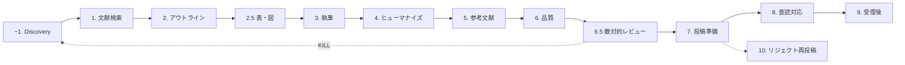

<div align="center">

# Paper Writer Skill

**原稿工場ではない。研究エンジン。**

医学・科学論文のための Claude Code / エージェントスキル。Discoveryゲート、ステージゲート付きIMRAD、日英ヒューマナイズ、敵対的レビュー、投稿・査読対応まで。人間が主権を持つのは **💡 IDEA** と **📊 DATA**。

[](https://github.com/kgraph57/paper-writer-skill/actions/workflows/tests.yml)
[](LICENSE)
[](SKILL.md)
[](CHANGELOG.md)

[English](README.md) | 日本語

**紹介サイト:** https://kgraph57.github.io/paper-writer-skill/ja/

</div>

## なぜスターされるか

- **書く前のDiscovery。** Phase −1で質問を鍛え、ライブ文献で新規性を見て、人間が💡 IDEAをロックし📊 DATAを確認するまで本文に進まない。
- **自動修正付きステージゲート。** 8ゲート。FAIL → フィードバック → 修正エージェント → 再チェック（最大3回）。
- **敵対的レビューがKILLできる。** 投稿前に中心主張をレッドチーム。致命傷ならDiscoveryへ戻す。
- **日英ヒューマナイズ。** 英語18・日本語13の学術AIパターン（`references/humanizer-academic.md`）。
- **6タイプ / 20+ガイドライン。** 原著・症例・総説・SR・レター・プロトコル。
- **チームモード + テスト済みスクリプト。** 並列エージェントと `table1.py` 等をCIで検証。

## 60秒スタート

```bash
npx skills add kgraph57/paper-writer-skill
```

または:

```bash
git clone https://github.com/kgraph57/paper-writer-skill.git ~/.claude/skills/paper-writer
```

呼び出し例: `論文を書く` / `論文執筆` / `原稿作成` / `write paper` / `/paper-writer`

## パイプライン


```mermaid
graph LR
    P0["−1. Discovery"] --> P1[1. 文献検索]
    P1 --> P2[2. アウトライン]
    P2 --> P25[2.5 表・図]
    P25 --> P3[3. 執筆]
    P3 --> P4[4. ヒューマナイズ]
    P4 --> P5[5. 参考文献]
    P5 --> P6[6. 品質]
    P6 --> P65["6.5 敵対的レビュー"]
    P65 --> P7[7. 投稿準備]
    P65 -.->|KILL| P0
    P7 --> P8[8. 査読対応]
    P8 --> P9[9. 受理後]
    P7 -.-> P10[10. リジェクト再投稿]
```

文献検索にはネットワークを使います（設計どおり）。テレメトリはありません。生の臨床データはローカルのまま（`SECURITY.md`）。

## ケーススタディ（2分）

**[Discovery → 草稿 → ヒューマナイズ → 敵対的レビュー](examples/case-studies/discovery-to-draft.md)**

## 対応論文タイプ

| タイプ | 構造 | ガイドライン |
|------|-----------|---------------------|
| **原著** | フルIMRAD | STROBE / CONSORT |
| **症例報告** | Intro / Case / Discussion | CARE |
| **総説** | テーマ別 | — |
| **システマティックレビュー** | PRISMA | PRISMA 2020 |
| **レター / Short** | 圧縮IMRAD | 原著に準ずる |
| **研究プロトコル** | SPIRIT | SPIRIT 2025 |

## アーキテクチャ要約

- **ステージゲート (v3.1):** PASSするまで次フェーズに進まない。FAILは最大3回の自動修正。
- **チームモード (v3.0):** 文献・表図・執筆・ヒューマナイズ・査読を並列化。
- **詳細:** [`SKILL.md`](SKILL.md)、[`templates/`](templates/)、[`references/`](references/)

## リポジトリ地図

| パス | 内容 |
|------|------|
| [`docs/`](docs/) | GitHub Pages 紹介サイト |
| [`examples/case-studies/`](examples/case-studies/) | 公開ケース |
| [`LAUNCH.md`](LAUNCH.md) | 投稿キット（X JP/EN、Show HN） |
| [`SECURITY.md`](SECURITY.md) | PHI / ネットワーク方針 |

## 要件

- Claude Code など `SKILL.md` を読むエージェント
- WebSearch / WebFetch（文献）
- ユーティリティ用に Python 3（任意で `requirements.txt`）

## 開発

```bash
python -m py_compile scripts/*.py
bash -n scripts/*.sh
python -m unittest discover -s tests -v
```

## ライセンス

[MIT](LICENSE) — Copyright (c) 2026 KEN.

## バージョン

- **v3.2.0** — 研究プロジェクトフォルダ管理
- **v3.1.0** — 自律ステージゲート
- **v3.0.0** — チームモード

詳細は [CHANGELOG.md](CHANGELOG.md)。

---

<div align="center">

査読に耐える原稿と、データについて嘘をつかない姿勢が大事なら — **[★ Star](https://github.com/kgraph57/paper-writer-skill)** してエージェントに載せてください。

</div>
