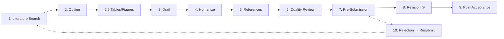
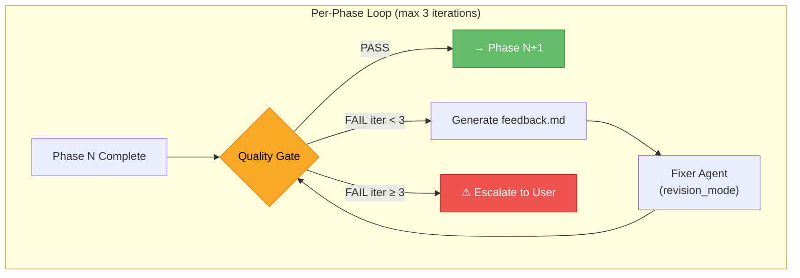
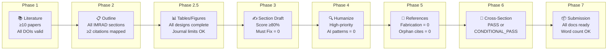
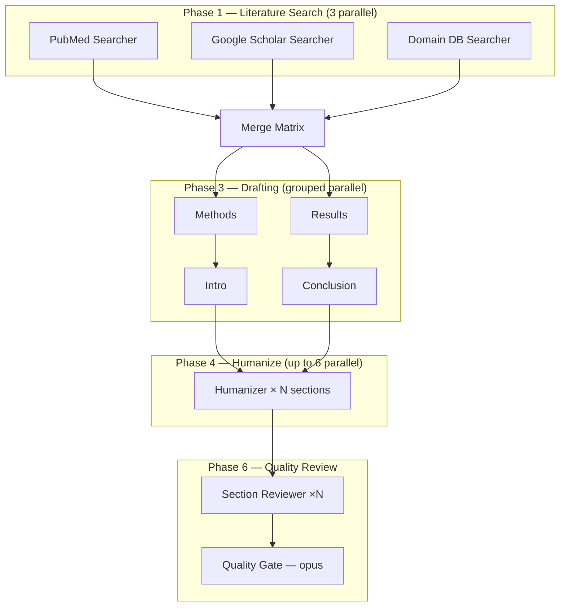

# Paper Writer Skill

A Claude Code skill for medical/scientific paper writing. Covers the entire manuscript lifecycle from literature search to submission, peer review response, and rejection handling.

> **日本語版はこちら → [README.ja.md](README.ja.md)**

## Overview

A **10-phase** pipeline that generates and manages IMRAD-format project directories with structured Markdown files, a literature matrix, and quality checklists.



## Architecture: Autonomous Stage-Gate System (v3.1)

Every phase is guarded by a quality gate. If the gate returns **FAIL**, the system automatically generates structured feedback, dispatches a fixer agent in `revision_mode`, and re-checks — up to 3 iterations before escalating to the user. No phase proceeds until its gate returns **PASS**.



### 8 Quality Gates



### Team Mode: 7 Parallel Agents (v3.0)

Phases are parallelized with specialized agents running concurrently:



| Agent | Role | Model |
|-------|------|-------|
| `paper-lit-searcher` | Database-specific literature search | sonnet |
| `paper-table-figure-planner` | Table and figure design | sonnet |
| `paper-section-drafter` | Section drafting (parameterized) | sonnet |
| `paper-humanizer` | AI writing pattern removal | haiku |
| `paper-ref-builder` | Citation collection and verification | sonnet |
| `paper-section-reviewer` | Per-section quality check | sonnet |
| `paper-quality-gate` | Cross-section consistency + final verdict | opus |

## Supported Paper Types

| Type | Structure | Reporting Guideline |
|------|-----------|---------------------|
| **Original Article** | Full IMRAD | STROBE / CONSORT |
| **Case Report** | Intro / Case / Discussion | CARE |
| **Review Article** | Thematic sections | — |
| **Systematic Review** | PRISMA-compliant | PRISMA 2020 |
| **Letter / Short Communication** | Condensed IMRAD | Same as original |
| **Study Protocol** | SPIRIT-compliant | SPIRIT 2025 |

## Usage

### Invoke from Claude Code

```
/paper-writer
```

Or use natural language triggers:
- `write paper` / `start manuscript` / `research paper`
- `論文を書く` / `論文執筆` / `原稿作成`

### Project Setup

The skill prompts you for:

1. **Working title**
2. **Paper type** (one of the 6 types above)
3. **Target journal** (optional, recommended)
4. **Language** (English / Japanese / Both)
5. **Research question** (one sentence)
6. **Available data** (existing tables/figures)

When a target journal is specified, the skill automatically looks up word limits, citation style, abstract format, and other requirements.

## Generated Project Structure (v3.2)

Each paper project generates a comprehensive directory for managing the entire research lifecycle:

```
{project-dir}/
├── README.md                        # Project dashboard (status, timeline, links)
├── 00_literature/                   # Literature search & matrix
├── 01_outline.md                    # Paper skeleton
├── sections/                        # Manuscript sections (writing order)
│   ├── 02_methods.md ... 08_title.md
├── tables/                          # Tables (numbered)
├── figures/                         # Figures + captions
├── supplements/                     # Supplementary materials
│   ├── supplementary-tables/
│   ├── supplementary-figures/
│   └── appendices/
├── data/                            # Research data (raw → processed → analysis)
│   ├── raw/                         # Original data (READ-ONLY, gitignored)
│   ├── processed/                   # Cleaned, de-identified
│   ├── analysis/                    # Statistical output
│   └── data-dictionary.md
├── ethics/                          # IRB, consent, protocol, registration
├── submissions/                     # Submission history (v1_bmj/, v2_lancet/, ...)
│   └── v1_{journal}/               # Compiled manuscript + cover letter + declarations
├── revisions/                       # Revision rounds (r1/, r2/, ...)
│   └── r1/                          # Reviewer comments + response + diff
├── coauthor-review/                 # Co-author feedback tracking
├── correspondence/                  # Editor & reviewer communication log
├── references/                      # Formatted reference list
├── checklists/                      # Quality gates, reporting guideline tracking
└── log/                             # Decisions, meetings, timeline
```

## File Structure

```
paper-writer/
├── SKILL.md                           # Main workflow definition
├── CHANGELOG.md                       # Version history
├── README.md                          # This file
├── README.ja.md                       # Japanese documentation
│
├── templates/                         # 31 files — Section templates
│   ├── project-init.md                # Project initialization (Original Article)
│   ├── project-init-case.md           # Project initialization (Case Report)
│   ├── literature-matrix.md           # Literature comparison matrix
│   ├── methods.md                     # Methods writing guide
│   ├── results.md                     # Results writing guide
│   ├── introduction.md                # Introduction writing guide
│   ├── discussion.md                  # Discussion writing guide
│   ├── conclusion.md                  # Conclusion writing guide
│   ├── abstract.md                    # Abstract writing guide (Original Article)
│   ├── cover-letter.md                # Cover letter template
│   ├── submission-ready.md            # Pre-submission checklist
│   ├── case-report.md                 # Case presentation (CARE-compliant)
│   ├── case-introduction.md           # Case report introduction
│   ├── case-abstract.md               # Case report abstract (CARE format)
│   ├── review-article.md              # Review article structure guide
│   ├── sr-outline.md                  # Systematic review outline
│   ├── sr-data-extraction.md          # SR data extraction template
│   ├── sr-prisma-flow.md              # PRISMA flow diagram
│   ├── sr-grade.md                    # GRADE evidence assessment
│   ├── sr-rob.md                      # Risk of bias assessment
│   ├── sr-prospero.md                 # PROSPERO registration template
│   ├── response-to-reviewers.md       # Response to reviewers template
│   ├── revision-cover-letter.md       # Revision cover letter
│   ├── declarations.md                # Declarations (ethics, COI, funding, AI disclosure)
│   ├── graphical-abstract.md          # Graphical abstract guide
│   ├── title-page.md                  # Title page template
│   ├── highlights.md                  # Key points / highlights (JAMA, BMJ, etc.)
│   ├── limitations-guide.md           # Limitations section guide
│   ├── acknowledgments.md             # Acknowledgments template
│   ├── proof-correction.md            # Post-acceptance proof correction guide
│   ├── data-management.md             # Data management (raw/processed/analysis)
│   └── analysis-workflow.md           # Data analysis workflow guide
│
├── references/                        # 27 files — Reference materials
│   ├── imrad-guide.md                 # IMRAD structure and writing principles
│   ├── section-checklist.md           # Per-section quality checklist
│   ├── citation-guide.md              # Citation formatting and management
│   ├── citation-verification.md       # Citation verification guide
│   ├── reporting-guidelines.md        # Reporting guidelines summary
│   ├── reporting-guidelines-full.md   # 20+ reporting guidelines with checklists
│   ├── humanizer-academic.md          # AI writing detection (EN 18 + JP 13 patterns)
│   ├── statistical-reporting.md       # Statistical reporting guide
│   ├── statistical-reporting-full.md  # Extended SAMPL guide
│   ├── journal-selection.md           # Journal selection strategy
│   ├── pubmed-query-builder.md        # PubMed search query builder
│   ├── multilingual-guide.md          # Multilingual support guide
│   ├── coauthor-review.md             # Co-author review process
│   ├── ai-disclosure.md               # ICMJE 2023 AI disclosure guide
│   ├── tables-figures-guide.md        # Tables and figures creation guide
│   ├── keywords-guide.md              # Keywords and MeSH selection strategy
│   ├── supplementary-materials.md     # Supplementary materials strategy
│   ├── hook-compatibility.md          # Claude Code hook compatibility
│   ├── submission-portals.md          # Submission portal guide
│   ├── open-access-guide.md           # OA models, APCs, CC licenses
│   ├── clinical-trial-registration.md # Clinical trial registration guide
│   ├── abstract-formats.md            # Journal-specific abstract formats
│   ├── word-count-limits.md           # Word count limits by journal
│   ├── coi-detailed.md               # COI categories, CRediT taxonomy, ORCID
│   ├── desk-rejection-prevention.md   # Desk rejection prevention
│   ├── journal-reformatting.md        # Journal reformatting and cascading strategy
│   └── master-reference-list.md       # Master URL list (100+ links, 13 categories)
│
└── scripts/                           # 5 files — Utilities & Analysis
    ├── compile-manuscript.sh           # Compile sections into single manuscript
    ├── word-count.sh                  # Word count utility
    ├── forest-plot.py                 # Forest plot generator
    ├── table1.py                      # Table 1 generator (baseline characteristics)
    └── analysis-template.py           # Statistical analysis template (t-test, logistic, survival)
```

**Total: 66 files** (31 templates + 27 references + 5 scripts + SKILL.md + CHANGELOG.md + README.md)

## Workflow (10 Phases)

| Phase | Description | Key Operations |
|-------|-------------|----------------|
| **0** | Project Initialization | Journal requirements lookup, reporting guideline selection, directory generation, data management & analysis |
| **1** | Literature Search | PubMed/Google Scholar search, literature matrix creation |
| **2** | Outline | Paper skeleton design (user approval required) |
| **2.5** | Tables & Figures | Design tables/figures before writing prose |
| **3** | Drafting | Methods → Results → Intro P3 + Conclusion → Discussion → Intro P1-2 → Abstract → Title |
| **4** | Humanize | AI writing pattern removal (EN 18 + JP 13 patterns) |
| **5** | References | Citation formatting, deduplication, existence verification |
| **6** | Quality Review | Cross-section verification, reporting guideline compliance |
| **7** | Pre-Submission | Cover letter, title page, declarations, final checklist |
| **8** | Revision | Reviewer comment organization, response letter, revision implementation |
| **9** | Post-Acceptance | Proof review (24-72 hr), correction submission, post-publication tasks |
| **10** | Rejection & Resubmission | Assessment, quick reformat, cascading submission strategy |

## Reporting Guidelines (20+)

CONSORT 2025, STROBE, PRISMA 2020, CARE, STARD 2015, SQUIRE 2.0, SPIRIT 2025, TRIPOD+AI 2024, ARRIVE 2.0, CHEERS 2022, MOOSE, TREND, SRQR, COREQ, AGREE II, RECORD, STREGA, ENTREQ, PRISMA-ScR, GRADE

## Language Support

| Language | Coverage |
|----------|----------|
| **English** | All templates and guides, 18 AI writing detection patterns |
| **Japanese** | All templates bilingual (EN/JP), 13 AI writing detection patterns, である-style |

## AI Writing Detection (Humanizer)

A dedicated phase (Phase 4) to remove AI-generated writing patterns from academic manuscripts.

- **English**: 18 patterns (significance inflation, AI vocabulary, filler phrases, etc.)
- **Japanese**: 13 patterns (symbol overuse, rhythm monotony, academic-specific issues)
- Section-specific priority patterns
- Before/after examples included

## Master Reference List

`references/master-reference-list.md` contains 100+ URLs organized in 13 categories:

1. Author Guidelines (ICMJE, EQUATOR, etc.)
2. Reporting Guidelines (CONSORT, STROBE, etc.)
3. Ethics & Registration (ClinicalTrials.gov, UMIN, etc.)
4. Statistics (SAMPL, Cochrane, etc.)
5. Literature Databases (PubMed, Google Scholar, etc.)
6. Reference Managers (Zotero, Mendeley, etc.)
7. Submission Portals (ScholarOne, etc.)
8. AI Disclosure (ICMJE, Nature policies, etc.)
9. Open Access (DOAJ, Sherpa Romeo, etc.)
10. Writing Support (editing services, etc.)
11. Figure/Table Tools (BioRender, GraphPad, etc.)
12. Journal Author Instructions (major journals)
13. Japanese Resources (Ichushi, CiNii, etc.)

## Installation

Clone this repository into the Claude Code skills directory:

```bash
git clone https://github.com/kgraph57/paper-writer-skill.git ~/.claude/skills/paper-writer
```

Register the skill in Claude Code settings:

```json
// Add to "skills" in ~/.claude/settings.json
{
  "skills": {
    "paper-writer": {
      "path": "~/.claude/skills/paper-writer"
    }
  }
}
```

## Requirements

- [Claude Code](https://claude.ai/code) CLI
- WebSearch / WebFetch (used for literature search)
- Python 3 + numpy, pandas, scipy, statsmodels, lifelines, matplotlib (for data analysis scripts)

## License

Private repository.

## Versions

- **v3.2.0** (2026-03-05) — Research project folder management: comprehensive directory restructuring
- **v3.1.0** (2026-03-05) — Autonomous Stage-Gate System: 8 quality gates with auto-fix loops
- **v3.0.0** (2026-03-05) — Team Mode: 7 parallel agents for concurrent execution
- **v2.1.0** (2026-02-17) — Data management & analysis integration, 4 new files
- **v2.0.0** (2026-02-17) — Full lifecycle coverage, 16 new files, 10 phases
- **v1.0.0** (2026-02-17) — Structural improvements, 6 new files, 5 paper types

See [CHANGELOG.md](CHANGELOG.md) for details.
