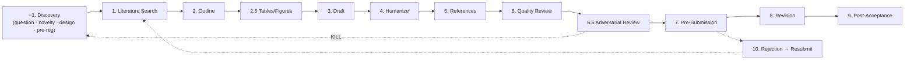

<div align="center">

# Paper Writer Skill

**Not a manuscript factory. A research engine.**

A Claude Code / agent skill for medical and scientific manuscripts: Discovery gates, stage-gated IMRAD drafting, EN+JP humanizing, adversarial review, and submission/revision loops. Humans stay sovereign on the **💡 IDEA** and the **📊 DATA**.

[](https://github.com/kgraph57/paper-writer-skill/actions/workflows/tests.yml)
[](LICENSE)
[](SKILL.md)
[](CHANGELOG.md)

English | [日本語](README.ja.md)

**Live intro:** https://kgraph57.github.io/paper-writer-skill/

</div>

## Why This Gets Starred

- **Discovery before drafting.** Phase −1 forges and ranks research questions, checks novelty against live literature, and designs/powers the study — then stops until a human locks the 💡 IDEA and confirms 📊 DATA (real, IRB-aware, never model-invented).
- **Stage-gates that auto-fix.** Eight quality gates. FAIL → structured feedback → fixer agent → re-check (up to 3 loops). No silent proceed to the next phase.
- **Adversarial review can KILL.** Before submission, the skill red-teams its own central claim. Fatal problems return to Discovery instead of polishing a bad paper.
- **EN + JP humanizer.** Phase 4 removes academic AI-tell patterns (18 English + 13 Japanese) with before/after examples and section priorities — see `references/humanizer-academic.md`.
- **Six paper types, 20+ guidelines.** Original, Case Report, Review, Systematic Review, Letter/Short, Study Protocol — CARE / CONSORT / STROBE / PRISMA / SPIRIT and more wired into templates.
- **Team mode.** Seven parallel specialist agents for literature, drafting, humanize, and review (v3.0+).
- **Tested utilities.** `table1.py`, SR helpers, compile/word-count scripts — CI runs `unittest` + shell syntax checks.

## 60-Second Start

```bash
# 1. Install as an agent skill (Claude Code, Cursor, Codex, and other skills hosts)
npx skills add kgraph57/paper-writer-skill
```

Or clone into Claude Code’s skills directory:

```bash
git clone https://github.com/kgraph57/paper-writer-skill.git ~/.claude/skills/paper-writer
```

Then ask in plain language:

```text
Use the paper-writer skill to start a CARE case report from these de-identified notes…
```

```text
論文を書く。症例報告。CARE。データは匿名化済み。
```

Triggers: `write paper` / `start manuscript` / `research paper` / `論文を書く` / `論文執筆` / `原稿作成` — or `/paper-writer` in Claude Code.

## The Pipeline


```mermaid
graph LR
    P0["−1. Discovery\n(question · novelty · design · pre-reg)"] --> P1[1. Literature Search]
    P1 --> P2[2. Outline]
    P2 --> P25[2.5 Tables/Figures]
    P25 --> P3[3. Draft]
    P3 --> P4[4. Humanize]
    P4 --> P5[5. References]
    P5 --> P6[6. Quality Review]
    P6 --> P65["6.5 Adversarial Review"]
    P65 --> P7[7. Pre-Submission]
    P65 -.->|KILL| P0
    P7 --> P8["8. Revision"]
    P8 --> P9["9. Post-Acceptance"]
    P7 -.-> P10["10. Rejection → Resubmit"]
    P10 -.-> P1
```

Optional Python packages for analysis/PDF utilities: `python -m pip install -r requirements.txt`. Literature work uses WebSearch/WebFetch and public literature APIs — **not** a zero-network skill (by design).

## Case Study (2-minute read)

**[Discovery → draft → humanize → adversarial catch](examples/case-studies/discovery-to-draft.md)** — an illustrative CARE spark (PHI-free) showing why gates beat “just write the abstract.”

## Supported Paper Types

| Type | Structure | Reporting Guideline |
|------|-----------|---------------------|
| **Original Article** | Full IMRAD | STROBE / CONSORT |
| **Case Report** | Intro / Case / Discussion | CARE |
| **Review Article** | Thematic sections | — |
| **Systematic Review** | PRISMA-compliant | PRISMA 2020 |
| **Letter / Short Communication** | Condensed IMRAD | Same as original |
| **Study Protocol** | SPIRIT-compliant | SPIRIT 2025 |

## Architecture (deep dive)

### Autonomous Stage-Gate System (v3.1)

Every phase is guarded by a quality gate. If the gate returns **FAIL**, the system generates structured feedback, dispatches a fixer agent in `revision_mode`, and re-checks — up to 3 iterations before escalating to the user.

### 8 Quality Gates

Literature (≥10 papers, valid DOIs) → Outline (IMRAD + citations mapped) → Tables/Figures → Section draft score → Humanize (high-priority AI patterns = 0) → References (no fabrication / orphans) → Cross-section consistency → Submission package.

### Team Mode: 7 Parallel Agents (v3.0)

| Agent | Role |
|-------|------|
| `paper-lit-searcher` | Database-specific literature search |
| `paper-table-figure-planner` | Table and figure design |
| `paper-section-drafter` | Section drafting |
| `paper-humanizer` | AI writing pattern removal |
| `paper-ref-builder` | Citation collection and verification |
| `paper-section-reviewer` | Per-section quality check |
| `paper-quality-gate` | Cross-section consistency + final verdict |

## Repository Map

| Path | What |
|------|------|
| [`SKILL.md`](SKILL.md) | Main workflow definition |
| [`docs/`](docs/) | GitHub Pages landing |
| [`examples/case-studies/`](examples/case-studies/) | Public case study |
| [`templates/`](templates/) | Section / project / CARE / SR templates |
| [`references/`](references/) | Humanizer, adversarial, guidelines, journals… |
| [`scripts/`](scripts/) | Compile, word-count, table1, SR utilities |
| [`LAUNCH.md`](LAUNCH.md) | Posting kit (X JP/EN, Show HN) |
| [`SECURITY.md`](SECURITY.md) | PHI / network / permissions |

Full file tree and phase tables remain in [`SKILL.md`](SKILL.md) and the templates/references trees (37 templates · 30 reference docs · 8 scripts).

## Language Support

| Language | Coverage |
|----------|----------|
| **English** | All templates and guides, 18 AI writing detection patterns |
| **Japanese** | Bilingual templates, 13 AI writing detection patterns, である-style |

## Requirements

- [Claude Code](https://claude.ai/code) CLI or another agent that loads `SKILL.md`
- WebSearch / WebFetch (literature)
- Python 3 for optional utility scripts
- `python -m pip install -r requirements.txt` for analysis/PDF helpers

## Development

```bash
python -m py_compile scripts/*.py
bash -n scripts/*.sh
python -m unittest discover -s tests -v
```

## License

[MIT](LICENSE) — Copyright (c) 2026 KEN.

## Versions

- **v3.2.0** — Research project folder management
- **v3.1.0** — Autonomous Stage-Gate System
- **v3.0.0** — Team Mode (7 parallel agents)

See [CHANGELOG.md](CHANGELOG.md) for details.

---

<div align="center">

If you want manuscripts that survive review — and refuse to lie about data — **[★ Star the repo](https://github.com/kgraph57/paper-writer-skill)** and install it on your agent.

</div>
